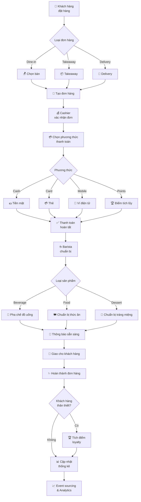
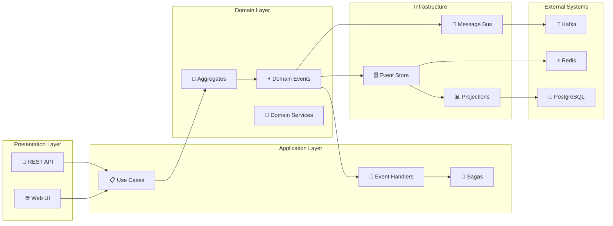

# Coffee Shop Management System

Hệ thống quản lý quán cà phê được xây dựng với Spring Boot, áp dụng Domain-Driven Design (DDD) và Clean Architecture.

## Cấu trúc dự án

```
src/main/java/com/coffeeshop/management/
├── domain/                           # Domain Layer (Business Logic)
│   ├── entities/                     # Domain Entities
│   ├── valueobjects/                # Value Objects
│   ├── repositories/                # Repository Interfaces
│   ├── services/                    # Domain Services
│   └── events/                      # Domain Events & Event Processing
│       ├── handlers/                # Domain Event Handlers
│       └── publishers/              # Domain Event Publishers
├── application/                     # Application Layer (Use Cases)
│   ├── usecases/                    # Use Cases/Interactors
│   ├── dtos/                        # Application DTOs
│   ├── mappers/                     # Mappers
│   ├── services/                    # Application Services
│   ├── eventhandlers/               # Application Event Handlers
│   └── sagas/                       # Saga Orchestrators (Distributed Transactions)
├── infrastructure/                  # Infrastructure Layer (External Concerns)
│   ├── repositories/                # Repository Implementations
│   ├── persistence/
│   │   ├── entities/                # JPA Entities
│   │   └── mappers/                 # Persistence Mappers
│   ├── external/                    # External Service Integrations
│   ├── configurations/              # Infrastructure Configurations
│   └── events/                      # Event Infrastructure
│       ├── store/                   # Event Store Implementation
│       ├── messaging/               # Message Broker Integration (Kafka)
│       ├── outbox/                  # Outbox Pattern Implementation
│       ├── projections/             # Event Projections (Read Models)
│       └── snapshots/               # Event Sourcing Snapshots
└── presentation/                    # Presentation Layer (Controllers)
    ├── controllers/                 # REST Controllers
    ├── dtos/
    │   ├── requests/                # Request DTOs
    │   └── responses/               # Response DTOs
    ├── configurations/              # Web Configurations
    └── exceptions/                  # Exception Handlers
```

## Công nghệ sử dụng

### Core Framework
- **Java 17**
- **Spring Boot 3.2.1**
- **Spring Data JPA**
- **Spring Security**

### Event-Driven Architecture
- **Apache Kafka** - Message Streaming Platform
- **Axon Framework** - Event Sourcing & CQRS
- **Redis** - Event Store & Caching

### Database
- **PostgreSQL** (Docker environment)
- **H2** (Development/Testing)

### Utilities
- **Lombok** - Reduce Boilerplate Code
- **MapStruct** - Object Mapping
- **SpringDoc OpenAPI** - API Documentation (Swagger)

## 🚀 Cài đặt và chạy dự án

### 📋 Yêu cầu hệ thống
- **Docker & Docker Compose** (khuyến nghị)
- Java 17+ (nếu chạy local)
- Maven 3.6+ (nếu chạy local)

### 🐳 Chạy với Docker (Khuyến nghị - CHỈ CẦN 1 LỆNH)

#### **Khởi động toàn bộ hệ thống:**
```bash
docker-compose up -d
```

#### **Dừng toàn bộ hệ thống:**
```bash
docker-compose down
```

#### **Xem logs của ứng dụng:**
```bash
# Xem logs Coffee Management App
docker logs coffee-management-app --tail 50 -f

# Xem logs tất cả services
docker-compose logs -f --tail=10
```

#### **Kiểm tra trạng thái containers:**
```bash
docker-compose ps
```

### 🌐 **Thông tin truy cập sau khi khởi động:**

| Service | URL | Mô tả | Credentials |
|---------|-----|-------|-------------|
| **Coffee Management API** | http://localhost:8090/api | Main application API | - |
| **Swagger UI** | http://localhost:8090/api/swagger-ui.html | API Documentation | - |
| **Health Check** | http://localhost:8090/api/actuator/health | Application health | - |
| **Keycloak Admin** | http://localhost:8080 | Authentication server | admin/admin123 |
| **Kafka UI** | http://localhost:8088 | Kafka management | - |
| **Redis Commander** | http://localhost:8081 | Redis management | - |
| **Axon Server** | http://localhost:8124 | Event store dashboard | - |

### 🔧 **Khởi động lại sau khi tắt máy:**

Khi bạn khởi động lại máy tính, chỉ cần chạy:
```bash
docker-compose up -d
```

**Lưu ý:** Đợi khoảng 30-60 giây để tất cả services khởi động hoàn tất.

### 💻 **Chạy local với profile DEV (Hybrid approach)**

#### ✅ **Infrastructure trên Docker + Application local**

**Profile `dev` kết hợp:**
- **Infrastructure services**: Chạy trên Docker (PostgreSQL, Redis, Kafka, Axon Server, Keycloak)
- **Application**: Chạy local trên IDE với enhanced debugging

#### Các bước:
1. **Khởi động infrastructure services:**
   ```bash
   docker-compose up -d postgres redis kafka zookeeper axonserver keycloak kafka-ui redis-commander
   ```

2. **Cài đặt dependencies:**
   ```bash
   mvn clean install
   ```

3. **Chạy application với profile dev:**
   ```bash
   mvn spring-boot:run -Dspring-boot.run.profiles=dev
   ```

#### **Hoặc chạy từ IDE:**
- **IntelliJ**: Set VM options: `-Dspring.profiles.active=dev`
- **VS Code**: Set environment variable: `SPRING_PROFILES_ACTIVE=dev`

#### **Development URLs:**
- **Coffee Management API**: http://localhost:8080/api
- **Swagger**: http://localhost:8080/api/swagger-ui.html
- **Keycloak Admin**: http://localhost:8080 (admin/admin123)
- **Kafka UI**: http://localhost:8088
- **Redis Commander**: http://localhost:8081
- **Axon Server**: http://localhost:8124

#### **Lợi ích của approach này:**
- ✅ **Full debugging** capabilities trong IDE
- ✅ **Hot reload** khi thay đổi code
- ✅ **Enhanced logging** và detailed SQL tracing
- ✅ **Sử dụng infrastructure thật** (PostgreSQL, Redis, Kafka)
- ✅ **Consistent với Docker environment**

### 🏢 **Chạy local với infrastructure đầy đủ (Tùy chọn)**

#### Yêu cầu:
- PostgreSQL server chạy local
- Redis server chạy local  
- Kafka server chạy local
- Axon Server chạy local

#### Các bước:
1. Clone repository
2. Cấu hình database trong `application.yml`
3. Cài đặt dependencies:
   ```bash
   mvn clean install
   ```
4. Chạy ứng dụng:
   ```bash
   mvn spring-boot:run
   ```

### 🛠️ **Troubleshooting**

#### Nếu có lỗi container name conflict:
```bash
docker-compose down
docker system prune -f
docker-compose up -d
```

#### Nếu database connection failed:
- Kiểm tra PostgreSQL container đang chạy: `docker ps | findstr postgres`
- Xem logs PostgreSQL: `docker logs postgres`

#### Nếu port đã được sử dụng:
```bash
# Kiểm tra process sử dụng port 8090
netstat -ano | findstr :8090

# Dừng container cũ
docker stop coffee-management-app
docker rm coffee-management-app
```

## 🏪 Nghiệp vụ và Chức năng hệ thống

### 📋 Tổng quan nghiệp vụ
Hệ thống Coffee Shop Management là một giải pháp quản lý toàn diện cho quán cà phê, được thiết kế để hỗ trợ tất cả các hoạt động từ quản lý sản phẩm, đơn hàng, khách hàng đến nhân viên.

### 🎯 Các Domain nghiệp vụ chính

#### 1. **👥 Quản lý Người dùng & Nhân viên (User & Employee Management)**
- **Quản lý tài khoản người dùng**: Đăng ký, đăng nhập, phân quyền
- **Quản lý nhân viên**: 
  - Thông tin cá nhân, vị trí công việc, phòng ban
  - Cấu trúc quản lý (manager-employee relationship)
  - Trạng thái nhân viên (ACTIVE, INACTIVE, TERMINATED)
  - Lương và ngày tuyển dụng
- **Phân quyền**: Manager, Barista, Cashier với các quyền khác nhau

#### 2. **👤 Quản lý Khách hàng (Customer Management)**
- **Hồ sơ khách hàng**: Thông tin cá nhân, liên hệ, ngày sinh
- **Chương trình khách hàng thân thiết**:
  - Điểm tích lũy (loyalty points)
  - Cấp độ thành viên: BRONZE, SILVER, GOLD, PLATINUM
  - Ưu đãi theo cấp độ
- **Tùy chọn liên hệ**: EMAIL, PHONE, SMS

#### 3. **📦 Quản lý Sản phẩm & Danh mục (Product & Category Management)**
- **Danh mục sản phẩm có cấu trúc phân cấp**:
  - **Beverages**: Hot Coffee, Cold Coffee, Tea, Non-Coffee
  - **Food**: Breakfast, Lunch, Snacks
  - **Desserts**: Cakes, Pastries
  - **Merchandise**: Coffee shop branded items
- **Thông tin sản phẩm chi tiết**:
  - Giá bán, giá vốn, kích thước (SMALL, MEDIUM, LARGE, EXTRA_LARGE)
  - Loại sản phẩm (BEVERAGE, FOOD, DESSERT, MERCHANDISE)
  - Thông tin dinh dưỡng (calories), thời gian chuẩn bị
  - Quản lý tồn kho (stock_quantity, min_stock_level)
  - Thông tin dị ứng (allergen_info)
  - Sản phẩm nổi bật và trạng thái có sẵn

#### 4. **🛒 Quản lý Đơn hàng (Order Management)**
- **Quy trình đặt hàng hoàn chỉnh**:
  - Tạo đơn hàng với mã đơn hàng duy nhất
  - Loại đơn hàng: DINE_IN, TAKEAWAY, DELIVERY
  - Trạng thái đơn hàng: PENDING → CONFIRMED → PREPARING → READY → COMPLETED/CANCELLED
- **Chi tiết đơn hàng**:
  - Danh sách sản phẩm (order_items) với số lượng và ghi chú
  - Tính toán tổng tiền: subtotal, tax, discount, total
  - Thời gian ước tính hoàn thành
  - Số bàn (cho dine-in)
- **Quản lý trạng thái sản phẩm trong đơn**: PENDING → PREPARING → READY → SERVED

#### 5. **💳 Quản lý Thanh toán (Payment Management)**
- **Phương thức thanh toán đa dạng**:
  - CASH (tiền mặt)
  - CARD (thẻ)
  - MOBILE (ví điện tử)
  - LOYALTY_POINTS (điểm tích lũy)
- **Trạng thái thanh toán**: PENDING → PAID/FAILED/REFUNDED
- **Tích hợp với hệ thống điểm thưởng**

#### 6. **📊 Báo cáo và Thống kê (Reporting & Analytics)**
- **Báo cáo doanh thu**: Theo ngày, tuần, tháng
- **Báo cáo sản phẩm bán chạy**: Top selling products
- **Báo cáo nhân viên**: Hiệu suất, số đơn hàng xử lý
- **Báo cáo khách hàng**: Khách hàng thân thiết, tần suất mua hàng
- **Báo cáo tồn kho**: Sản phẩm sắp hết, cần nhập thêm

### 🔄 Luồng nghiệp vụ chính

#### 📊 Sơ đồ luồng đặt hàng tổng quan



#### 📋 Luồng Đặt hàng (Order Flow)
1. **Nhận đơn hàng**: Khách hàng đặt hàng (dine-in/takeaway/delivery)
2. **Xác nhận đơn hàng**: Nhân viên xác nhận và tính tổng tiền
3. **Thanh toán**: Xử lý thanh toán qua các phương thức khác nhau
4. **Chuẩn bị**: Barista chuẩn bị đồ uống/món ăn
5. **Hoàn thành**: Giao hàng cho khách hàng
6. **Tích điểm**: Cập nhật điểm thưởng cho khách hàng thân thiết

#### 🏆 Luồng Khách hàng thân thiết (Loyalty Flow)
1. **Đăng ký**: Khách hàng đăng ký chương trình thành viên
2. **Tích điểm**: Mỗi giao dịch tích lũy điểm
3. **Nâng cấp**: Tự động nâng cấp hạng thành viên khi đủ điều kiện
4. **Ưu đãi**: Áp dụng giảm giá và ưu đãi theo hạng
5. **Sử dụng điểm**: Thanh toán bằng điểm tích lũy

#### 📦 Luồng Quản lý Kho (Inventory Flow)
1. **Theo dõi tồn kho**: Real-time tracking số lượng sản phẩm
2. **Cảnh báo**: Thông báo khi sản phẩm sắp hết (dưới min_stock_level)
3. **Nhập kho**: Cập nhật số lượng khi nhập hàng mới
4. **Xuất kho**: Tự động trừ kho khi bán hàng
5. **Báo cáo**: Báo cáo tình trạng tồn kho định kỳ

### 🎭 Vai trò và Quyền hạn (Roles & Permissions)

#### 👨‍💼 Manager (Quản lý)
- Toàn quyền quản lý hệ thống
- Xem tất cả báo cáo và thống kê
- Quản lý nhân viên và phân ca
- Quản lý sản phẩm và giá cả
- Quản lý chương trình khuyến mãi

#### ☕ Barista (Pha chế)
- Xem và cập nhật trạng thái đơn hàng
- Quản lý việc chuẩn bị sản phẩm
- Cập nhật tình trạng sản phẩm trong đơn hàng
- Xem thông tin sản phẩm và công thức

#### 💰 Cashier (Thu ngân)
- Tạo và xử lý đơn hàng
- Xử lý thanh toán
- Quản lý thông tin khách hàng
- Áp dụng chương trình khuyến mãi và điểm thưởng

### 🚀 Tính năng Event-Driven

#### 📡 Domain Events
- **OrderCreated**: Khi đơn hàng được tạo
- **OrderConfirmed**: Khi đơn hàng được xác nhận
- **PaymentProcessed**: Khi thanh toán hoàn tất
- **ProductPrepared**: Khi sản phẩm chuẩn bị xong
- **LoyaltyPointsEarned**: Khi khách hàng tích điểm
- **StockLevelChanged**: Khi số lượng tồn kho thay đổi

#### 🔄 Event Sourcing Benefits
- **Audit Trail**: Lưu trữ toàn bộ lịch sử thay đổi
- **Replay Capability**: Có thể tái tạo lại trạng thái tại bất kỳ thời điểm nào
- **Analytics**: Phân tích xu hướng và patterns từ event stream
- **Integration**: Dễ dàng tích hợp với hệ thống bên ngoài

#### 🏗️ Kiến trúc Event-Driven



### 🔌 API Endpoints

#### 🔐 Authentication & Users
- `POST /api/auth/login` - Đăng nhập
- `POST /api/auth/logout` - Đăng xuất
- `GET /api/users/profile` - Xem profile
- `PUT /api/users/profile` - Cập nhật profile

#### 👥 Employee Management
- `GET /api/employees` - Danh sách nhân viên
- `POST /api/employees` - Tạo nhân viên mới
- `GET /api/employees/{id}` - Chi tiết nhân viên
- `PUT /api/employees/{id}` - Cập nhật nhân viên
- `DELETE /api/employees/{id}` - Xóa nhân viên

#### 👤 Customer Management
- `GET /api/customers` - Danh sách khách hàng
- `POST /api/customers` - Tạo khách hàng mới
- `GET /api/customers/{id}` - Chi tiết khách hàng
- `PUT /api/customers/{id}` - Cập nhật khách hàng
- `GET /api/customers/{id}/loyalty` - Thông tin điểm thưởng

#### 📦 Product & Category Management
- `GET /api/categories` - Danh sách danh mục
- `POST /api/categories` - Tạo danh mục mới
- `GET /api/products` - Danh sách sản phẩm
- `POST /api/products` - Tạo sản phẩm mới
- `GET /api/products/{id}` - Chi tiết sản phẩm
- `PUT /api/products/{id}` - Cập nhật sản phẩm
- `GET /api/products/featured` - Sản phẩm nổi bật
- `GET /api/products/search` - Tìm kiếm sản phẩm

#### 🛒 Order Management
- `GET /api/orders` - Danh sách đơn hàng
- `POST /api/orders` - Tạo đơn hàng mới
- `GET /api/orders/{id}` - Chi tiết đơn hàng
- `PUT /api/orders/{id}/status` - Cập nhật trạng thái đơn hàng
- `POST /api/orders/{id}/items` - Thêm sản phẩm vào đơn
- `GET /api/orders/pending` - Đơn hàng đang chờ
- `GET /api/orders/preparing` - Đơn hàng đang chuẩn bị

#### 💳 Payment Management
- `POST /api/payments` - Xử lý thanh toán
- `GET /api/payments/{id}` - Chi tiết thanh toán
- `POST /api/payments/{id}/refund` - Hoàn tiền
- `GET /api/payments/methods` - Danh sách phương thức thanh toán

#### 📊 Reports & Analytics
- `GET /api/reports/sales` - Báo cáo doanh thu
- `GET /api/reports/products/top-selling` - Sản phẩm bán chạy
- `GET /api/reports/employees/performance` - Hiệu suất nhân viên
- `GET /api/reports/customers/loyalty` - Báo cáo khách hàng thân thiết
- `GET /api/reports/inventory` - Báo cáo tồn kho

#### 🏆 Loyalty Program
- `GET /api/loyalty/points/{customerId}` - Điểm tích lũy
- `POST /api/loyalty/earn` - Tích điểm
- `POST /api/loyalty/redeem` - Sử dụng điểm
- `GET /api/loyalty/tiers` - Danh sách hạng thành viên

### 🎯 Use Cases chính của hệ thống

#### 👥 User & Employee Use Cases
- **UC-001**: Đăng nhập/Đăng xuất nhân viên
- **UC-002**: Quản lý hồ sơ nhân viên
- **UC-003**: Phân quyền dựa trên vai trò (Manager/Barista/Cashier)
- **UC-004**: Theo dõi hiệu suất làm việc

#### 👤 Customer Use Cases  
- **UC-101**: Đăng ký khách hàng thân thiết
- **UC-102**: Tích lũy và sử dụng điểm thưởng
- **UC-103**: Nâng cấp hạng thành viên tự động
- **UC-104**: Xem lịch sử mua hàng

#### 📦 Product Management Use Cases
- **UC-201**: Quản lý danh mục sản phẩm (CRUD)
- **UC-202**: Quản lý sản phẩm với thông tin chi tiết
- **UC-203**: Theo dõi tồn kho real-time
- **UC-204**: Cảnh báo sản phẩm sắp hết hàng
- **UC-205**: Tìm kiếm sản phẩm nâng cao

#### 🛒 Order Management Use Cases
- **UC-301**: Tạo đơn hàng (Dine-in/Takeaway/Delivery)
- **UC-302**: Thêm/Xóa sản phẩm trong đơn hàng
- **UC-303**: Tính toán tổng tiền (bao gồm tax, discount)
- **UC-304**: Theo dõi trạng thái đơn hàng real-time
- **UC-305**: Ước tính thời gian hoàn thành
- **UC-306**: Hủy đơn hàng và hoàn tiền

#### 💳 Payment Use Cases
- **UC-401**: Xử lý thanh toán đa phương thức
- **UC-402**: Thanh toán bằng điểm tích lũy
- **UC-403**: Xử lý hoàn tiền
- **UC-404**: Ghi nhận giao dịch vào hệ thống

#### 📊 Reporting & Analytics Use Cases
- **UC-501**: Báo cáo doanh thu theo thời gian
- **UC-502**: Phân tích sản phẩm bán chạy
- **UC-503**: Báo cáo hiệu suất nhân viên
- **UC-504**: Thống kê khách hàng thân thiết
- **UC-505**: Báo cáo tồn kho và dự báo nhập hàng

#### ⚡ Event-Driven Use Cases
- **UC-601**: Xử lý domain events real-time
- **UC-602**: Event sourcing cho audit trail
- **UC-603**: Tạo projections cho read models
- **UC-604**: Saga pattern cho distributed transactions
- **UC-605**: Outbox pattern đảm bảo consistency

### 🏪 Quy trình nghiệp vụ mẫu

#### ☕ Kịch bản: Khách hàng đặt cappuccino takeaway
1. **Cashier** tạo đơn hàng mới (UC-301)
2. Thêm Cappuccino vào đơn hàng (UC-302)
3. Áp dụng discount nếu có (UC-303)
4. Khách hàng thanh toán bằng thẻ (UC-401)
5. **Barista** nhận notification chuẩn bị (UC-304)
6. Cập nhật trạng thái: PREPARING → READY (UC-304)
7. Thông báo khách hàng đến lấy
8. Hoàn thành đơn hàng và tích điểm (UC-102)
9. Cập nhật tồn kho coffee beans (UC-203)
10. Ghi nhận event để analytics (UC-601)

#### 🏆 Kịch bản: Khách hàng thân thiết nâng cấp hạng
1. Khách hàng SILVER mua đơn hàng $50
2. Hệ thống tích điểm tự động (UC-102)
3. Kiểm tra điều kiện nâng cấp GOLD
4. Tự động nâng cấp hạng thành viên (UC-103)
5. Gửi notification về ưu đãi mới
6. Cập nhật discount rate cho lần mua tiếp theo

## Nguyên tắc thiết kế

### Domain-Driven Design (DDD)
- **Domain Layer**: Chứa business logic và domain models
- **Application Layer**: Orchestrates domain objects để thực hiện use cases
- **Infrastructure Layer**: Implementations của interfaces được định nghĩa trong domain
- **Presentation Layer**: Handles HTTP requests và responses

### Clean Architecture
- **Dependency Rule**: Dependencies chỉ point inward
- **Independence**: Business logic không phụ thuộc vào framework, UI, database
- **Testability**: Business logic có thể test mà không cần external dependencies

### Event-Driven Architecture
- **Event Sourcing**: Lưu trữ state changes dưới dạng events
- **CQRS**: Tách biệt Command và Query models
- **Saga Pattern**: Quản lý distributed transactions
- **Outbox Pattern**: Đảm bảo eventual consistency
- **Event Projections**: Tạo read models từ event stream
- **Snapshots**: Tối ưu hóa event replay

## Cấu hình

### 🗄️ Database Configuration
- **Docker Environment**: PostgreSQL (`coffe_management` database)
- **Development**: H2 in-memory database  
- **Production**: PostgreSQL

### 🔄 Event Infrastructure
- **Kafka**: Message streaming (localhost:9092)
- **Redis**: Event store và caching (localhost:6379)
- **Axon Framework**: Event sourcing và CQRS

### 🔐 Security & Authentication
- **Keycloak**: OAuth2/JWT authentication server
- **Spring Security**: Role-based authorization
- **JWT**: Stateless authentication

### 📊 Monitoring & Observability
- **Health Checks**: Spring Actuator endpoints
- **Swagger UI**: API documentation
- **Logging**: Structured logging với multiple levels
- **Event Tracing**: Distributed tracing với Axon
- **Metrics**: Application metrics via Actuator

### 🐳 Docker Services
| Service | Port | Description |
|---------|------|-------------|
| coffee-management-app | 8090 | Main Spring Boot application |
| postgres | 5432 | PostgreSQL database |
| redis | 6379 | Redis cache/session store |
| kafka | 9092 | Apache Kafka message broker |
| zookeeper | 2181 | Kafka coordination service |
| axonserver | 8024/8124 | Axon event store |
| keycloak | 8080 | Authentication server |
| kafka-ui | 8088 | Kafka management UI |
| redis-commander | 8081 | Redis management UI |
